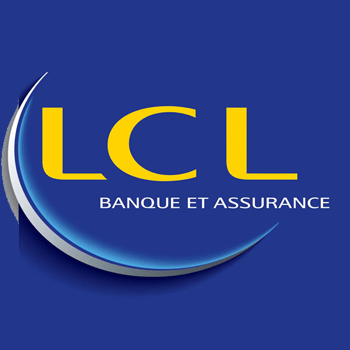
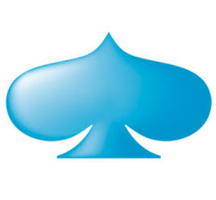

## 2021 - Shodo

{: .align-left .comment__avatar}

Software Engineer (current position)

{: .align-right .comment__avatar}

### EDF (in progress)

## 2017 - Xebia France

{: .align-left .comment__avatar}

Coding Architect (4 years)

{: .align-right .comment__avatar}

### Sonepar (1 year)

Tech lead for one of the teams in charge of Spark project, which consists in the implementation of a global digital platform for Sonepar companies all over the world.

* Microservices, Hexagonal Architecture, Java 11, Spring Boot, Lombok, Resilience4j, Gatling, MongoDB, Redis, Azure Kubernetes Services, Azure DevOps, Azure API Management, Open API

{: .align-right .comment__avatar}

### Cafeyn (2 months)

Audit of the technical asset: workshops and interviews, audit of the code base, presentation of key findings and recommendations.

{: .align-right .comment__avatar}

### Europ Assistance (2 years)

Tech lead and software architect for the digital transformation project of Europ Assistance, Digital Roadside Assistance.

* New features (Java 8, Spring Boot, Lombok, Kotlin, PostgreSQL, Flyway, Kubernetes, Istio)
* Specification and implementation of API for communication with affiliates (API Blueprint, Open API, Dredd, Server-Sent Events, AWS S3, AWS Kinesis)
* Modularisation of the back end of core application: identification of subdomains, design and refactoring (Domain-Driven Design, Event Storming, Example Mapping, Hexagonal Architecture, Event Sourcing, AWS SNS, AWS SQS)

{: .align-right .comment__avatar}

### LCL (1 year)

Rework of the back end of LCL into microservices as a tech lead for Data Layer project.

* Java 8, Spring Boot, Hystrix, MongoDB, Docker, Spring Batch, Hexagonal Architecture

## 2009 - Signalis

{: .align-left .comment__avatar}

Software Engineer (8 years)

{: .align-right .comment__avatar}

### Signalis (3 years)

Developer and tech lead for STYRIS product extensions.

* STYRIS Web application (JavaScript, OpenLayers, Angular, WMS, Java SE, Spring Boot, Hystrix)
* IVEF interface (Java SE, Dagger, Netty, JMX)
* Back-end for sensors state display (Java SE, REST, Dagger, Netty, Protobuf, Jersey, JMX)

{: .align-right .comment__avatar}

### Airbus (2½ years)

Software architect for the integration of STYRIS product as the maritime surveillance component in Airbus ACTACOR border security solution.

* Java EE, WildFly, Cassandra, RTI DDS

{: .align-right .comment__avatar}

### Suez Canal Authority (4 months)

Management of a development team for Suez Canal vessel traffic management project.

* Java EE, Hibernate, WebLogic, Oracle DB

{: .align-right .comment__avatar}

### DGA (2 years)

Design and development of a secured data exchange application for Spationav V2 coastal surveillance project (French General Directorate for Armament), management of a small team.

* Users management web application (Java EE, GWT, JBoss)
* Generic module for secured Java EE server calls (Java EE, Kerberos, OpenLDAP)
* Secured data exchange web application (Java EE, GWT, JBoss, REST, PostgreSQL)

{: .align-right .comment__avatar}

### Qatar NSS (2 years)

As part of Qatar border surveillance project, development of surveillance application modules, design and development of a multi-site reconfiguration web application, management of a small team.

* Sensors settings persistence (Java EE, Hibernate, JBoss)
* Sensors state display (Java EE, XUL)
* Users management (Java SE, Active Directory)
* Multi-site system reconfiguration web application (Java EE, GWT, JBoss, JMS)

## 2007 - Capgemini

{: .align-left .comment__avatar}

CTI Consultant (2 years)

{: .align-right .comment__avatar}

### DGFiP (6 months)

As part of the migration from a traditional CRM application to a web CRM application for French Ministry of Finance, integration of CTI pop-up application and development of CRM modules.

* CRM specific modules (Java EE, Struts, Ajax, JBoss AS, Oracle DB)
* CTI screen pop-up application (Visual Basic, Axis Web Services, Cisco CIL API)

{: .align-right .comment__avatar}

### LaSer Cofinoga (15 months)

Design and development of a CTI pop-up web application as part of setting-up an 1500-agent IP contact center for LaSer Cofinoga.

* Java EE, ICEfaces, Hibernate, Jetty Server, Oracle DB, Genesys

{: .align-right .comment__avatar}

### Capgemini (6 months)

Design and development of a PoC application for the integration of Java EE internet self-service to Genesys contact center platform.

* Java EE, WebLogic, SIP, VoIP

## 2006 - Cerene Services

{: .align-left .comment__avatar}

Trainee (2 months)

Design and development of a modem-embedded application for the transmission of GPS positions through GPRS/Iridium networks.

* C, GPC, Iridium, GPRS

## 2005 - Institut Delaunay

{: .align-left .comment__avatar}

Trainee (6 months)

Integration of document-oriented protocol WebDAV to specific knowledge management applications.

* C, PHP, WebDAV, UML

## 2004 - Poole Hospital

{: .align-left .comment__avatar}

Trainee (3 months)

Development of an intranet catalog for the purchase of IT equipment by all services of the hospital.

* VB .net, ASP .net, Access, SQLServer